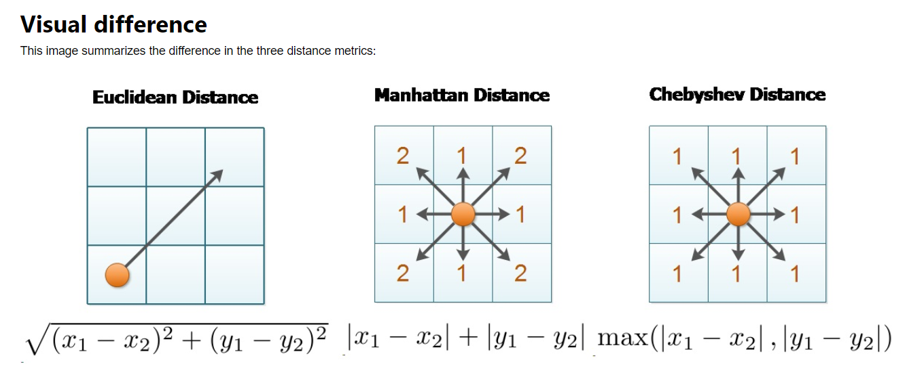
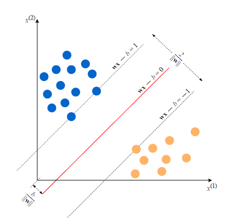
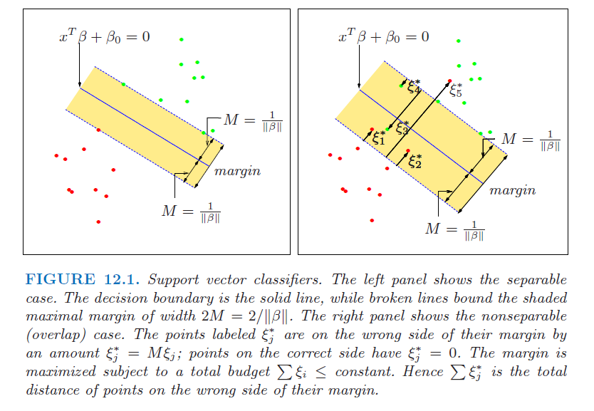
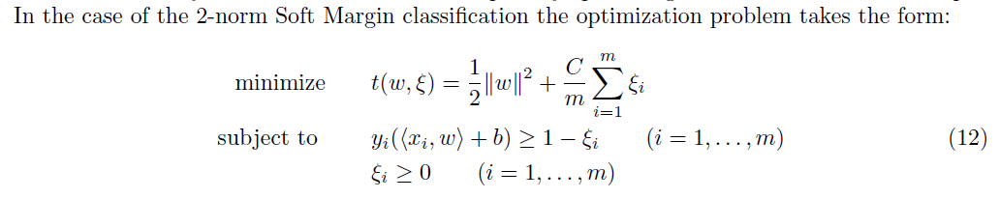
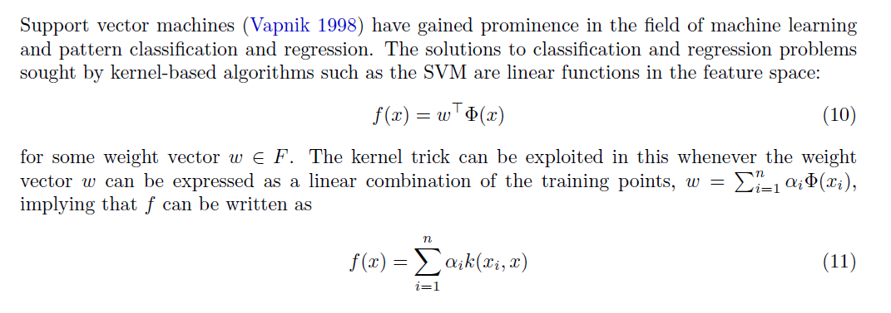

```{r global_options, echo=FALSE}
knitr::opts_chunk$set(warning=FALSE, message=FALSE)
```

# Linear Regression Models

- Linear Regression is one of the most basic tools a Data Scientist or Analyst can
use for analyzing data. It is also used as a prerequiste for other advanced regression and
machine learning techniques.

## Linear Regression model equations can be written either directly or indirectly in the form:

### $$y_i = b_0 + b_1x_{i1} + b_2x_{i2} + ... + b_Px_{iP} + e_i$$

Where:

- $y_i$ is the outcome or response
- $b_0$ is the Y-intercept
- $P$ is the number of predictor variables
- $b_1$ through $b_P$ are the coefficients or parameters of the regression
- $x_1$ through $x_P$ are the predictor variables
- $e_i$ is the prediction error term 


# Linear Regression models 

## Goal: to minimize the sum of squared errors (SSE) or a function of the sum of squared errors 

### Minimize SSE

OLS - Ordinary Least Squares

PLS - Partial Least Squares

### Minimize a function of the SSE

Penalized Models

- Ridge Regression
- Lasso
- Elastic Net

#### Ridge Regression

- Adds a penalty on the sum of the squared regression parameters and is defined by
the formula below:

$$
\begin{aligned}
SSE_{L_2} = \sum_{i=1}^n (y_i - \hat{y_i})^2 + \lambda \sum_{j=1}^P \beta_j^2
\end{aligned}
$$

- $L_2$ is for the second-order penalty hence the squared value in the parameter
estimates.

- What the second term (penalty) does is that the coefficient estimates can become
large if there is a reduction on the SSE.

- For large $\lambda$ reduces the estimates near 0. However, the parameters never
become actually zero and in addition, ridge regression does not perform feature 
selection.

#### LAsso

- While ridge regression penalizes the sum of squared coefficnents, LASSO penalizes
the sum of absolute values that is:

$$
\begin{aligned}
SSE_{L_1} = \sum_{i=1}^n (y_i - \hat{y_i})^2 + \lambda \sum_{j=1}^P |{\beta_j}|
\end{aligned}
$$

- Another neat feature is that LASSO may actually make a coefficient = 0 so therefore
it also does feature selection.

- Much like Ridge Regression, we can get the $\lambda$ value that minimizes the MSE
as well as extract the coefficients from it. Note that if a feature coefficient has
just '.' is because LASSO penalized that coefficient to be zero and has done feature
selection.

#### Elastic Net

- LASSO does well when there aren't many parameters and some are already close to 0

- Ridge regressions works well if there are many parameters of almost the same value.

- LASSO may also take away variables that actually may greatly influence the response
variable.

- Introducing Elastic Net which combines both and the function is as follows:

$$
\begin{aligned}
SSE_{E_{net}} = \sum_{i=1}^n (y_i - \hat{y_i})^2 + 
\lambda_1 \sum_{j=1}^P \beta_j^2 + \lambda_2 \sum_{j=1}^P |{\beta_j}|
\end{aligned}
$$

- With this, you get the feature selection power of LASSO and penalties of both
methods in one.

# Linear Regression Pros and Cons

## Advantages:

- Estimated coefficients allow for interpretation of the relationships between predictors
- Coefficient standard errors can be calculated and used to assess the statistical significance of each predictor

## Disadvantages:

- They may not be able to adequately capture relationships that are not linear

<br><br>


# Non-Linear Regression

## Non-linear regression equations take the form:

### $$y = f(x,\beta) + \varepsilon$$

Where:

- $x$ is a vector of $p$ predictors
- $\beta$ is a vector of $k$ parameters
- $f()$ is a known regression function (that is not linear)
- $\varepsilon$ is the prediction error term


#### *Any model equation that cannot be written in the linear form $y_i = b_0 + b_1x_{i1} + b_2x_{i2} + ... + b_Px_{iP} + e_i$ is non-linear!*


# Non-Linear Regression Pros and Cons

## Advantages:

- They can fit almost any functional form and you don't need to know the form before training the model
- Can model much more complex relationships between the predictors and the outcome than linear models

## Disadvantages:

- Can be computationally expensive
- Some models can be prone to overfitting

<br><br>

# Non-Linear Regression Model Types


## Neural Networks (NN)

Inspired by theories about how the brain works and the interconnectedness of the neurons in the brain

## Multivariate Regression Splines (MARS)

Splits each predictor into two groups using a "hinge" or "hockey-stick" function and models linear relationships to the outcome for each group separately

## K-Nearest Neighbors (KNN)

Predicts new samples by finding the closest samples in the training set predictor space and taking the mean of their response values.  K represents the number of closest samples to consider.

## Support Vector Machines (SVM)

Robust regression that aims to minimize the effect of outliers with an approach that uses a subset of the training data points called "support vectors" to predict new values, and counter-intuitively excludes data points closest to the regression line from the prediction equation.


# Neural Networks

##	Introduction

- Neural Network

```{r, out.width = "100px", echo=FALSE, fig.align='center'}
knitr::include_graphics("syn.PNG")
knitr::include_graphics("deep_nn.PNG")
```

- Deep Neural Network - Modeled by Neural network of the brain
  -	Input-Dendrite (Artificial NN Input values)
  - Nucleus (Inputs with unique weights and summed together and passed threshold in 1 to many hidden layers (neural network 1 layer, deep) neural network >1 layers)
  -	Output - Axon and terminal (Based on about becomes a 0 or 1 with Sigmoid function) Transformed by a nonlinear function g(). 


## Computing examples

```{r include=FALSE}
# Partition and Normalize all variables to 0 and 1
library(dplyr)
data<-read.csv("covidsurv.csv", header=TRUE)
names(data)
data<-subset(data,select=(names(data[12:ncol(data)-2])))
glimpse(data)
d1<-as.data.frame(sapply(data,function(x) as.integer(x)))
d2<-as.data.frame(sapply(d1, function(x)(x-min(x)/max(x)-min(x))))
d2<-as.data.frame (sapply(d2, function(x) ifelse(x>0, 1, 0)))
d2$q03_symptoms<-as.factor(d2$q03_symptoms)
#for int (var-min(var)/max(var)-min(var))
set.seed(1234)
ind<-sample(2, nrow(d2), replace = TRUE, prob=c(.7, .3))
training<-d2[ind==1,]
testing<-d2[ind==2,]
```

```{r }
# Create Model
library(neuralnet)
nn<-neuralnet(q03_symptoms~., data=training, hidden =1 , linear.output=FALSE, rep=3) 
```


- Hidden is number of nodes/neuron in a layer, c(2,1) would be 2layers with  and 1 nodes/neurons
- Can add lifesign= 'full" to get all data points and rep = number of repetition times to run model. 
- When plotting with Rep can use plot(n, num) to show plot for rep.


## Computing examples

```{r out.width = "300px", echo=FALSE, fig.align='center'}
#Plot
show(plot(nn, 2))
```


```{r out.width = "300px", echo=FALSE, fig.align='center'}
#Predict
output<-compute(nn, training[-3])
head(output$net.result)
in1<-nn$weights[[2]][[1]][1]+sum(nn$weights[[2]][[1]]*nn$startweights[[2]][[1]])
out<-1/(1+exp(-in1))
in2<-nn$weights[[2]][[2]][1]+sum(nn$weights[[2]][[2]][2]*out)
out2<-1/(1+exp(-in2))
```


## Pros and Cons

### Pros
  - Robust with noisy data
  - Once trained, the predictions are pretty fast.
  - Neural networks can be trained with any number of inputs and layers.

### Cons
  - Neural networks are black boxes, meaning we cannot know how much each independent variable is influencing the dependent variables.
  - It is computationally very expensive and time consuming to train with traditional CPUs.
  - Neural networks depend a lot on training data. 


# Multivariate Adaptive Regression Splines

## Introduction

```{r, out.width = "400px", echo=FALSE, fig.align='center'}
knitr::include_graphics("mars.PNG")
```

- Creates 2 contrasted versions to of a predictor
- 1 or 2 predictors at a time
- Breaks predictors to 2 groups and models between
  - Left-hand - values > 0 than cut point
  - Right-hand - values < 0 than cut point


## Pros and Cons

### Pros
  - MARS models are more flexible than linear regression models.
  - MARS models are simple to understand and interpret.
  - MARS can handle both continuous and categorical data.

### Cons
  - MARS models do not give as good fits as boosted trees, but can be built much more quickly and are more interpretable. 
  - With MARS models, as with any non-parametric regression, parameter confidence intervals and other checks on the model cannot be calculated directly (unlike linear regression models)


# K-Nearest Neighbors

## Introduction

```{r, out.width = "200px", echo=FALSE, fig.align='center'}
knitr::include_graphics("knn1.png")
```

- a nonparametric lazy supervised learning method
    - does not make any assumptions about data distribution
    - does not require an explicit learning phase for generalization 
    - keeps all training examples in memory

- finds k training examples closest to x and returns 
    - the majority label (through 'votes'), in case of classification 
  


## Number of Neighbors

If k = 1, then the new instance is assigned to the class where its nearest neighbor. 

If we give a small (large) k input, it may lead to over-fitting (under-fitting).
To choose a proper k-value, one can count on cross-validation or bootstrapping. 

```{r, out.width = "800px", echo=FALSE}
knitr::include_graphics("knn2.png")
```


## Similarity/ Distance Metrics
- knn algorithm performs:
    - computation of distance matrix
    - ranking of k most similar objects. 

    
```{r, out.width = "600px", echo=FALSE}

```


K-Nearest Neighbor Classification of  Distance Version
method can be "euclidean", "maximum", "manhattan","canberra", "binary" or "minkowski"


```{r}
df <- read.table("C:/Users/OMERO/Documents/GitHub/DATA622/data.txt",header = T,sep=',')
df$label <- ifelse(df$label =="BLACK",1,0)
df$y <- as.numeric(df$y)
df$X <- as.factor(df$X)
```


```{r echo=FALSE}
library(class)
library(pROC)
library(ROCR)
library(caret)
library(C50)
library(e1071)
library(naivebayes)
library(MASS)
library(mltools)
library(knitr)

### Split Data into Train(60%) and Test data(30%) 
set.seed(998)
split_df <- createDataPartition(df$label, p = .60, list = FALSE)
df_train <- df[split_df,]
df_test <- df[-split_df,]
knnK3.model <- knn(df_train,df_test,cl=df_train$label,k=3)
knnK3.cm <- table(knnK3.model,df_test$label)
knnK3.pred <- prediction(as.numeric(knnK3.model) ,df_test$label)
knnK3.perf <- performance(knnK3.pred,measure="tpr",x.measure="fpr")
auc_roc(knnK3.model, df_test$label)
# Store the results

KNN_K3_RESULTS <- data.frame("ALGO"="KNN(K=3)","AUC" = performance(knnK3.pred,"auc")@y.values[[1]],
                 "ACC" = sum(diag(knnK3.cm)/(sum(rowSums(knnK3.cm)))),
                 "TPR" = knnK3.cm[2,2] / sum(knnK3.cm[2,]),
                 "FPR"= knnK3.cm[1,2] / sum(knnK3.cm[1,]),
                 "TNR" =  knnK3.cm[1,1] / sum(knnK3.cm[1,]),
                 "FNR"=  knnK3.cm[2,1] / sum(knnK3.cm[2,]))
KNN_K3_RESULTS
```


## Advantages & Disadvantages 

### Pros
    - cost of the learning process is zero
    - nonparametric, K-NN is pretty intuitive and simple
    - K-NN has no assumptions
    - No Training Step

### Cons
    - K-NN slow algorithm
    - Optimal number of neighbors
    - Imbalanced data causes problems

# Support Vector Machines

## Introduction

```{r, out.width = "170px", echo=FALSE, fig.align='center'}

```

- Black box method
    - applicable to both supervised regression and classification problems
    -	Involves optimally separating (maximal margin) hyperplanes 
        - in d-dimensional space, a hyperplane is a d-1 dimensional separator
    - For non-separable cases, a non-linear mapping transforms the data into a kernel-induced feature space F

## SVM Applications

- Bioinformatics 
    - Protein Structure Prediction
    - Breast Cancer Diagnosis
    
- Computer vision
    - Detecting Steganography in digital images
    - Intrusion Detection
    - Handwriting Recognition

- Computational linguistics

## Soft vs. Hard Margins

Allow some misclassification by introducing a slack penalty variable ($\xi$). T

```{r, out.width = "600px", echo=FALSE}

```


## Cost Penalty

The slack variable is regulated by hyperparameter cost parameter C. 
    - when C=0, there is a less complex boundary    
    - when C=inf, more complex boundary, as algorithms cannot afford to misclassify a single datapoint (overfitting)

```{r, out.width = "800px", echo=FALSE}

```


## SVM with High Cost Parameter

```{r eval=FALSE}
svm.model = svm(Species ~ ., data=iris.subset, type='C-classification', kernel='linear', cost=10000, scale=FALSE)
plot(x=iris.subset$Sepal.Length,y=iris.subset$Sepal.Width, col=iris.subset$Species, pch=19)
points(iris.subset[svm.model$index,c(1,2)],col="blue",cex=2)
w = t(svm.model$coefs) %*% svm.model$SV
b = -svm.model$rho #The negative intercept.
abline(a=-b/w[1,2], b=-w[1,1]/w[1,2], col="red", lty=5)
```


# Support Vector Machines

## Kernel Trick

All kernel functions take two feature vectors as parameters and return the scalar dot (inner) product of the vectors. Have property of symmetry and is positive semi-definite.

By performing convex quadratic optimization, we may rewrite the algorithm so that it is independent of transforming function $\phi$ 


```{r, out.width = "800px", echo=FALSE}

```


# Support Vector Machines

## Model Tuning (Cost & Gamma)

- One can tune hyperparameters (cost and gamma) using tune.svm() in e1071 and train() in caret

- For the gamma argument, 
    - the default value is equal to (1/data dimension), and 
    - it controls the shape of the separating hyperplane. 
    - Increasing the gamma argument usually increases the number of support vectors.


```{r eval=FALSE}
tuned = tune.svm(Species~., data = iris.subset, gamma = 10^(-6:-1),cost = 10^(0:2))
model.tuned = svm(Species~., data = iris.subset, gamma = tuned$best.parameters$gamma, cost = tuned$best.parameters$cost)
```


# Support Vector Machines

## Advantages & Disadvantages 

- Strengths
    - effective in high dimensional spaces (dim > N)
    - effective in cases where the number of dimensions is greater than the number of samples.
    - It works really well with a clear margin of separation
    - It uses a subset of training points in the decision function (called support vectors), so it is also memory efficient.
    - It is effective in high dimensional spaces.


- Drawbacks
    - It fails to perform well, when we have large data set because the required training time is higher
    - SVM doesn't directly provide probability estimates
    - It fails to perform, when the data set has more noise

